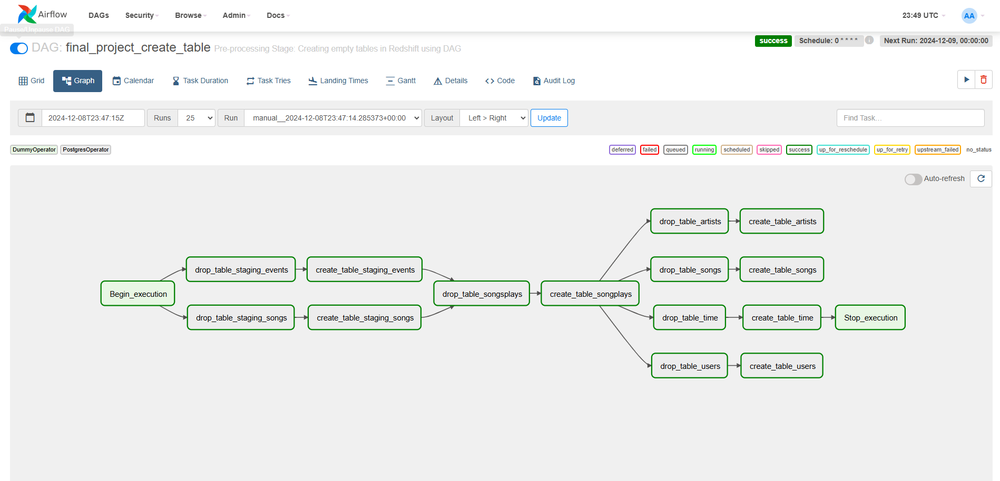

# Data Engineering with AWS

### <ins>Program Learning Outcomes</ins>  

* **Develop proficiency in Spark, Airflow, and Amazon Web Services tools.**
* **Automate and monitor production data pipelines.**
* **Build and interact with a cloud-based data lake.**
* **Work efficiently with massive datasets.**
* **Create scalable and efficient data warehouses in Cloud.**
* **Create user-friendly relational and NoSQL data models.**
___

## [Project 1: Data Pipelines with Airflow](./automate-data-pipelines-with-airflow)

### Objective: 

The objective of this project is to design and implement automated and monitored high grade data pipelines for Sparkify, a music streaming company, using Apache Airflow to enhance its data warehouse ETL processes. The main goals and requirements for the project are as follows:

**1. Automation and Monitoring**
- Implement automation in the ETL pipelines to streamline and enhance the data processing workflow.
- Ensure robust monitoring mechanisms to track the performance and health of the data pipelines.

**2. Dynamic and Reusable Data Pipelines**
- Design data pipelines that are dynamic, built from reusable tasks, and can be easily extended as needed.
- Incorporate functionality for easy backfills to accommodate historical data processing.

**3. Data Quality Assurance**
- Implement tests to validate data quality after the ETL steps have been executed.
- Ensure that any discrepancies in the datasets are detected and addressed before analyses are run on the DW.

**4. Data Integration**
- The source data, residing in S3, consists of JSON logs detailing user activity and JSON metadata about songs.
- Process and load the data into Sparkify's DW on Redshift, ensuring compatibility and efficient data flow.

## Datasets

For this project, you'll be working with two datasets. Here are the S3 links for each:

- **Log Data:**  
  `s3://udacity-dend/log_data`

- **Song Data:**  
  `s3://udacity-dend/song-data`

## Copy S3 Data

#### Step 1: Create Your S3 Bucket
Create a S3 bucket using the AWS Cloudshell
`aws s3 mb s3://akumar-dend/`

#### Step 2: Copy Data from Udacity's S3 Bucket to Your CloudShell Directory
`aws s3 cp s3://udacity-dend/log-data/ ~/log-data/ --recursive`
`aws s3 cp s3://udacity-dend/song-data/ ~/song-data/ --recursive`
`aws s3 cp s3://udacity-dend/log_json_path.json ~/`

### Order of Execution 
1. Copy S3 data from Udacity Bucket to Cloudshell --> Datasets and Copy S3 Data
2. Copy data from home cloudshell directory to akumar-dend (my S3 bucket)
3. Configure AWS Redshift Serverless (as per Lesson#3.12)
4. Add Airflow Connections to AWS Redshift (as per Lesson#3.13 - see images folder for connection)
5. Add Airflow User Setup (as per Lesson#3.5 - - see images folder for connection)
6. Run final_project_create_table DAG (create_redshift_tables.py) to trigger create tables in Redshift
7. Run final_project DAG (final_project.py) to trigger the data pipeline
   

> [!NOTE]
> School of Data Science, Udacity. Program curricula attached below.
[Program Syllabus](./Data%2BEngineering%2BNanodegree%2BProgram%2BSyllabus.pdf), more information about this program can be found by visiting [Udacity Data Engineering ND](https://www.udacity.com/course/data-engineer-nanodegree--nd027).
