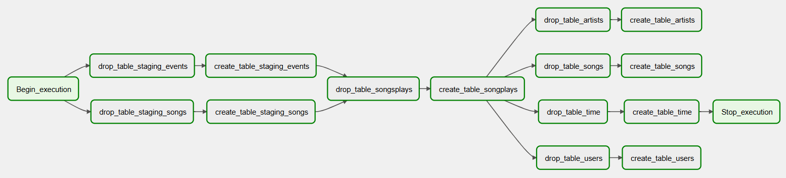
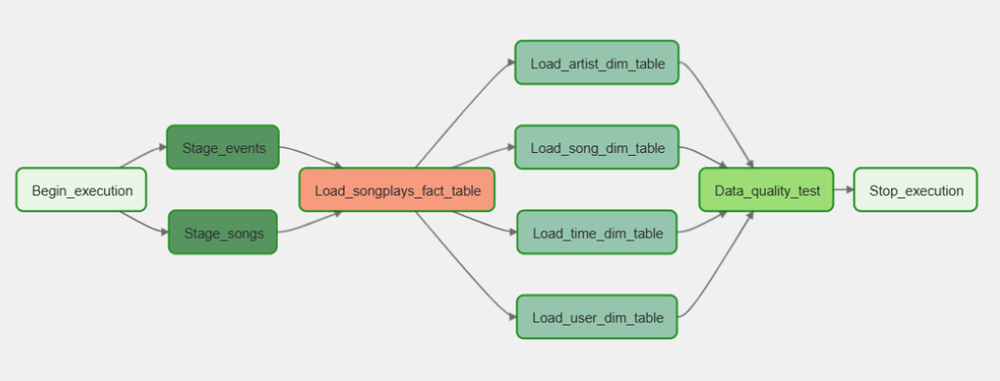
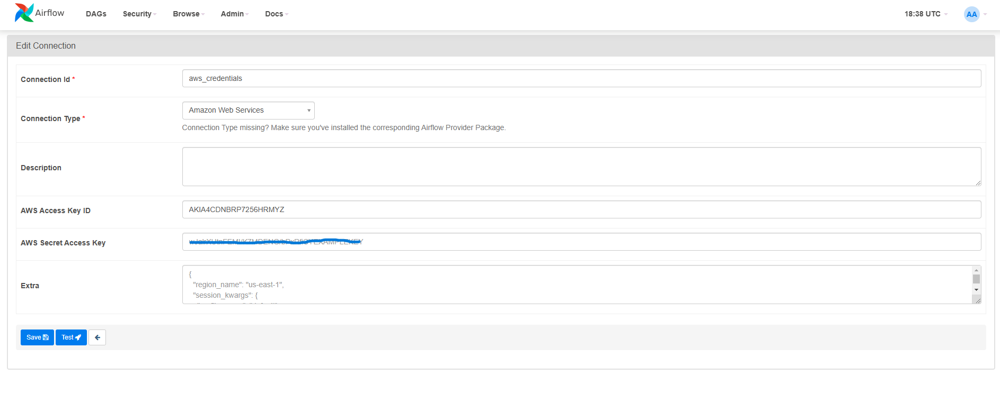
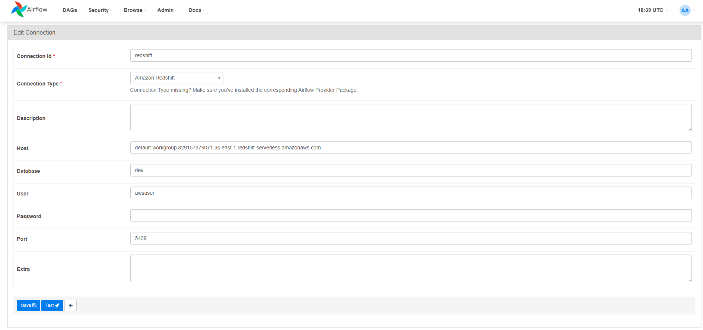
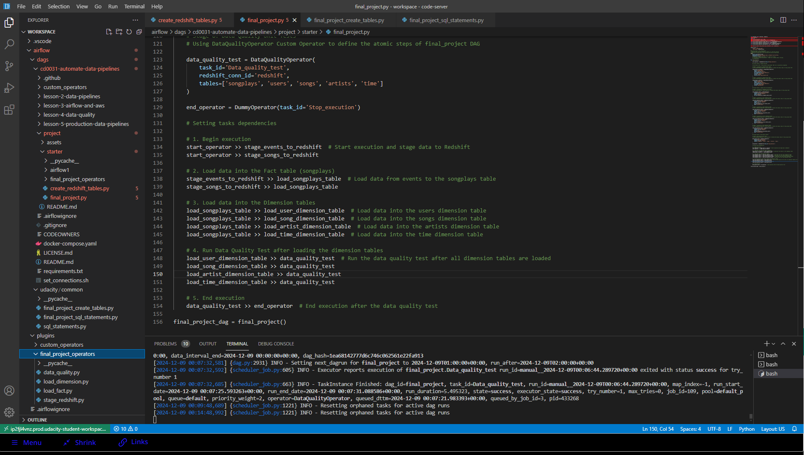
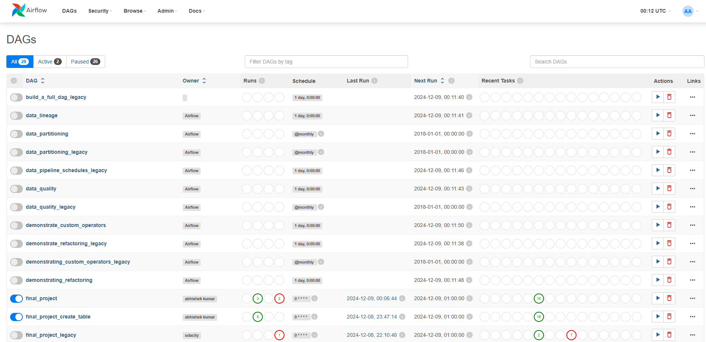
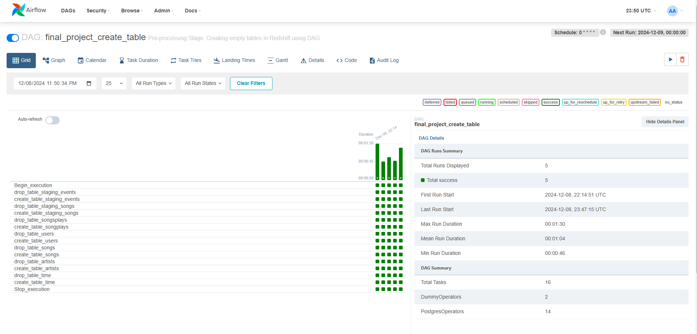

# Data Engineering with AWS

### <ins>List of Projects</ins>

| Module | Project Name |
| --- | --- |
| Automate Data Pipleines | [Data Pipelines with Airflow](./automate-data-pipelines-with-airflow) | 
| Spark and Data Lakes | [STEDI Human Balance Analytics](./automate-data-pipelines-with-airflow) |
| Cloud Data Warehouse | [Sparkify Cloud Data Warehouse in Redshift](./automate-data-pipelines-with-airflow) | 
| Data Modeling | [NoSQL Data Modeling with Apache Cassandra](./automate-data-pipelines-with-airflow) | 
_____
### <ins>Program Learning Outcomes</ins>  

* **Develop proficiency in Spark, Airflow, and Amazon Web Services tools.**
* **Automate and monitor production data pipelines.**
* **Build and interact with a cloud-based data lake.**
* **Work efficiently with massive datasets.**
* **Create scalable and efficient data warehouses in Cloud.**
* **Create user-friendly relational and NoSQL data models.**

> [!NOTE]
> ###### _School of Data Science, Udacity Inc., Mountain View, CA. "Nanodegree" is a registered trademark of Udacity. © 2011-2024 Udacity, Inc._

> [!TIP]
> ###### _More information about this program can be found by visiting [Udacity Data Engineering Nanodegree](https://www.udacity.com/catalog)._
_____

# [Project 1: Data Pipelines with Airflow](./automate-data-pipelines-with-airflow)

## Objective: 

The objective of this project is to design and implement automated and monitored high grade data pipelines for Sparkify, a music streaming company, using Apache Airflow to enhance its data warehouse ETL processes. The main goals and requirements for the project are as follows:

**1. Automation and Monitoring**
- Implement automation in the ETL pipelines to streamline and enhance the data processing workflow.
- Ensure robust monitoring mechanisms to track the performance and health of the data pipelines.

**2. Dynamic and Reusable Data Pipelines**
- Design data pipelines that are dynamic, built from reusable tasks, and can be easily extended as needed.
- Incorporate functionality for easy backfills to accommodate historical data processing.

**3. Data Quality Assurance**
- Implement tests to validate data quality after the ETL steps have been executed.
- Ensure that any discrepancies in the datasets are detected and addressed before analyses are run on the DW.

**4. Data Integration**
- The source data, residing in S3, consists of JSON logs detailing user activity and JSON metadata about songs.
- Process and load the data into Sparkify's DW on Redshift, ensuring compatibility and efficient data flow.

## Airflow DAGs

**1. `final_project_create_table` DAG overview**



**2. `final_project` DAG overview**



## Datasets

Datasets for this project (S3 Links):

- **Log Data:**  
  `s3://udacity-dend/log_data`

- **Song Data:**  
  `s3://udacity-dend/song-data`

## Copy S3 Data

#### Step 1: Create a S3 Bucket using the AWS Cloudshell
```bash
aws s3 mb s3://akumar-dend/`
```
#### Step 2: Copy Data from Udacity's S3 Bucket to Your CloudShell Directory
```bash
aws s3 cp s3://udacity-dend/log-data/ ~/log-data/ --recursive
aws s3 cp s3://udacity-dend/song-data/ ~/song-data/ --recursive
aws s3 cp s3://udacity-dend/log_json_path.json ~/
```
#### Step 3: Copy Data from Your CloudShell Directory to Your Own S3 Bucket
```bash
aws s3 cp ~/log-data/ s3://akumar-dend/log-data/ --recursive
aws s3 cp ~/song-data/ s3://akumar-dend/song-data/ --recursive
aws s3 cp ~/log_json_path.json s3://akumar-dend/
```
#### Step 4: Verify the Data is in Your S3 Bucket
```bash
aws s3 ls s3://akumar-dend/log-data/
aws s3 ls s3://akumar-dend/song-data/
aws s3 ls s3://akumar-dend/log_json_path.json
```

## AWS Redshift Serverless Configuration

#### Step 1: Create an IAM User (`awsuser`) in AWS

Create an IAM user named `awsuser` and assign the appropriate permissions.
- Attach the following policies to the IAM user:
  - _Administrator Access_
  - _AmazonRedshiftFullAccess_
  - _AmazonS3FullAccess_

#### Step 2: Create a Redshift Role (`redshift-dend`) via AWS CloudShell

- Attach the **AmazonS3FullAccess** policy to the role to provide full access to S3 using **AWS CloudShell**.
```bash
aws iam attach-role-policy --policy-arn arn:aws:iam::aws:policy/AmazonS3FullAccess --role-name redshift-dend
```

#### Step 3. Configure and Setup AWS Redshift Serverless

- Associate the IAM Role to establish a connection between Redshift Serverless and S3. 
- Configure Workgroup Settings:
  - Accept the default Workgroup settings.
  - Accept the defaults for Security and Encryption.
  - Enable Enhanced VPC Routing.
  - Add Inbound Rule to VPC Security Group associated with the Redshift cluste:
    - Type: Custom TCP
    - Port Range: 0 - 5500
    - Source: Anywhere-IPv4
    - Copy the Redshift Workgroup Endpoint (will be used later when configuring the Redshift connection in Airflow)

## Airflow Connection Configuration 

#### Step 1. Configure AWS Credentials Connection in Airflow

- Navigate to the **Airflow UI** and go to the **Connections** page. Click **Create** to add a new connection.
- On the **Create Connection** page, fill in the following values:
   - **Connection ID**: Enter `aws_credentials`
   - **Connection Type**: Choose `Amazon Web Services`
   - **AWS Access Key ID**: Enter the Access Key ID from the IAM User credentials you downloaded earlier.
   - **AWS Secret Access Key**: Enter the Secret Access Key from the IAM User credentials you downloaded earlier.
   - 


#### Step 2. Configure Redshift Connection in Airflow

##### **Connection Details:**
- **Connection ID**: `redshift`
- **Connection Type**: Amazon Redshift

##### **Steps:**
1. Navigate to the **Airflow UI** and go to the **Connections** page. Click **Create** to add a new connection.
2. On the **Create Connection** page, fill in the following values:
   - **Connection ID**: Enter `redshift`
   - **Connection Type**: Choose `Amazon Redshift`
   - **Host**: Enter the **endpoint** of your Redshift Serverless workgroup (excluding the port and schema name at the end). 
   - **Schema**: Enter `dev` (the Redshift database you want to connect to).
   - **Login**: Enter `awsuser` (the IAM user you created).
   - **Password**: Enter the password you set up when launching Redshift Serverless.
   - **Port**: Enter `5439` (the default Redshift port).



## Operators

- `Begin_execution` and `Stop_execution`
  - Dummy operators representing DAG start and end point

- `Stage_events` and `Stage_songs`
  - The stage operator loads JSON-formatted files from S3 to Amazon Redshift. 

- `Load_songplays_fact_table` & `Load_*_dim_table`
  - Load and Transform data from staging to fact and dimension target tables

- `Data_quality_tests`
  - Data quality operator which runs checks on the data itself.
  - Functionality: To receive SQL based test cases along with the expected results and execute the tests.
  - Example: Run data quality checks to ensure no empty table.



## DAG Execution
Trigger final_project_create_table DAG to create tables in Redshift



Trigger final_project_create_table DAG to create tables in Redshift



Run final_project DAG to trigger the ETL data pipeline


_____

# [Project 2: STEDI Human Balance Analytics](./automate-data-pipelines-with-airflow)
   
