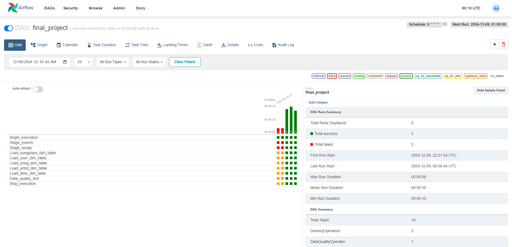

# Data Engineering with AWS

### <ins>List of Projects</ins>

| Module | Project Name |
| --- | --- |
| Automate Data Pipleines | [Data Pipelines with Airflow](./automate-data-pipelines-with-airflow) | 
| Spark and Data Lakes | [STEDI Human Balance Analytics](./automate-data-pipelines-with-airflow) |
| Cloud Data Warehouse | [Sparkify Cloud Data Warehouse in Redshift](./automate-data-pipelines-with-airflow) | 
| Data Modeling | [NoSQL Data Modeling with Apache Cassandra](./automate-data-pipelines-with-airflow) | 
_____
### <ins>Program Learning Outcomes</ins>  

* **Develop proficiency in Spark, Airflow, and Amazon Web Services tools.**
* **Automate and monitor production data pipelines.**
* **Build and interact with a cloud-based data lake.**
* **Work efficiently with massive datasets.**
* **Create scalable and efficient data warehouses in Cloud.**
* **Create user-friendly relational and NoSQL data models.**

> [!NOTE]
> ###### _School of Data Science, Udacity Inc., Mountain View, CA. "Nanodegree" is a registered trademark of Udacity. © 2011-2024 Udacity, Inc._

> [!TIP]
> ###### _More information about this program can be found by visiting [Udacity Data Engineering Nanodegree](https://www.udacity.com/catalog)._
_____

# [Project 1: Data Pipelines with Airflow](./automate-data-pipelines-with-airflow)

## Objective: 

The objective of this project is to design and implement automated and monitored high grade data pipelines for Sparkify, a music streaming company, using Apache Airflow to enhance its data warehouse ETL processes. The main goals and requirements for the project are as follows:

**1. Automation and Monitoring**
- Implement automation in the ETL pipelines to streamline and enhance the data processing workflow.
- Ensure robust monitoring mechanisms to track the performance and health of the data pipelines.

**2. Dynamic and Reusable Data Pipelines**
- Design data pipelines that are dynamic, built from reusable tasks, and can be easily extended as needed.
- Incorporate functionality for easy backfills to accommodate historical data processing.

**3. Data Quality Assurance**
- Implement tests to validate data quality after the ETL steps have been executed.
- Ensure that any discrepancies in the datasets are detected and addressed before analyses are run on the DW.

**4. Data Integration**
- The source data, residing in S3, consists of JSON logs detailing user activity and JSON metadata about songs.
- Process and load the data into Sparkify's DW on Redshift, ensuring compatibility and efficient data flow.

## Airflow DAGs

**1. `final_project_create_table` DAG overview**


**2. `final_project` DAG overview**


## Datasets

Datasets for this project (S3 Links):

- **Log Data:**  
  `s3://udacity-dend/log_data`

- **Song Data:**  
  `s3://udacity-dend/song-data`

## Copy S3 Data

#### Step 1: Create a S3 Bucket using the AWS Cloudshell
```bash
aws s3 mb s3://akumar-dend/`
```
#### Step 2: Copy Data from Udacity's S3 Bucket to Your CloudShell Directory
```bash
aws s3 cp s3://udacity-dend/log-data/ ~/log-data/ --recursive
aws s3 cp s3://udacity-dend/song-data/ ~/song-data/ --recursive
aws s3 cp s3://udacity-dend/log_json_path.json ~/
```
#### Step 3: Copy Data from Your CloudShell Directory to Your Own S3 Bucket
```bash
aws s3 cp ~/log-data/ s3://akumar-dend/log-data/ --recursive
aws s3 cp ~/song-data/ s3://akumar-dend/song-data/ --recursive
aws s3 cp ~/log_json_path.json s3://akumar-dend/
```
#### Step 4: Verify the Data is in Your S3 Bucket
```bash
aws s3 ls s3://akumar-dend/log-data/
aws s3 ls s3://akumar-dend/song-data/
aws s3 ls s3://akumar-dend/log_json_path.json
```

## AWS Redshift Serverless Configuration

#### Step 1: Create an IAM User (`awsuser`) in AWS

Create an IAM user named `awsuser` and assign the appropriate permissions.
- Attach the following policies to the IAM user:
  - _Administrator Access_
  - _AmazonRedshiftFullAccess_
  - _AmazonS3FullAccess_

#### Step 2: Create a Redshift Role (`redshift-dend`) via AWS CloudShell

- Attach the **AmazonS3FullAccess** policy to the role to provide full access to S3 using **AWS CloudShell**.
```bash
aws iam attach-role-policy --policy-arn arn:aws:iam::aws:policy/AmazonS3FullAccess --role-name redshift-dend
```

#### Step 3. Configure and Setup AWS Redshift Serverless

- Associate the IAM Role to establish a connection between Redshift Serverless and S3. 
- Configure Workgroup Settings:
  - Accept the default Workgroup settings.
  - Accept the defaults for Security and Encryption.
  - Enable Enhanced VPC Routing.
  - Add Inbound Rule to VPC Security Group associated with the Redshift cluste:
    - Type: Custom TCP
    - Port Range: 0 - 5500
    - Source: Anywhere-IPv4
    - Copy the Redshift Workgroup Endpoint (will be used later when configuring the Redshift connection in Airflow)

## Airflow Connection Configuration 

#### Step 1. Configure AWS Credentials Connection in Airflow

- Navigate to the **Airflow UI** and go to the **Connections** page. Click **Create** to add a new connection.
- On the **Create Connection** page, fill in the following values:
   - **Connection ID**: Enter `aws_credentials`
   - **Connection Type**: Choose `Amazon Web Services`
   - **AWS Access Key ID**: Enter the Access Key ID from the IAM User credentials you downloaded earlier.
   - **AWS Secret Access Key**: Enter the Secret Access Key from the IAM User credentials you downloaded earlier.
   - 


#### Step 2. Configure Redshift Connection in Airflow

- Navigate to the **Airflow UI** and go to the **Connections** page. Click **Create** to add a new connection.
- On the **Create Connection** page, fill in the following values:
   - **Connection ID**: Enter `redshift`
   - **Connection Type**: Choose `Amazon Redshift`
   - **Host**: Enter the **endpoint** of your Redshift Serverless workgroup (excluding the port and schema name at the end). 
   - **Schema**: Enter `dev` (the Redshift database you want to connect to).
   - **Login**: Enter `awsuser` (the IAM user you created).
   - **Password**: Enter the password you set up when launching Redshift Serverless.
   - **Port**: Enter `5439` (the default Redshift port).


## Tasks, Operators & Task Depedencies

- `Begin_execution` and `Stop_execution`
  - Dummy operators representing DAG start and end point

- `Stage_events` and `Stage_songs`
  - The stage operator loads JSON-formatted files from S3 to Amazon Redshift. 

- `Load_songplays_fact_table` & `Load_*_dim_table`
  - Load and Transform data from staging to fact and dimension target tables

- `Data_quality_tests`
  - Data quality operator which runs checks on the data itself.
  - Functionality: To receive SQL based test cases along with the expected results and execute the tests.
  - Example: Run data quality checks to ensure no empty table.


## DAG Execution

- DAG Dashboard


- Trigger **`final_project_create_table`** DAG to create tables in Redshift


- Run **`final_project`** DAG to trigger the ETL data pipeline



_____

# [Project 2: STEDI Human Balance Analytics](./automate-data-pipelines-with-airflow)

## Objective

This project involves building a **cloud-based data lakehouse solution** for sensor data collected by the STEDI Step Trainer and its mobile app to train a **machine learning model**. The solution will use: 
- **PySpark**: For processing large datasets.
- **AWS Glue**: Managed ETL for data preparation.
- **AWS Athena**: Serverless querying of data.
- **AWS S3**: Scalable storage for raw and processed data.
As a Data Engineer, you will extract and curate data from the **Step Trainer sensors** and the **mobile app** into the data lakehouse on AWS, enabling Data Scientists to train the model.

### STEDI Step Trainer Overview

The STEDI Step Trainer is a device designed to help users with balance exercises. It has the following features:

- **Sensors** detect motion and distance.
- The **mobile app** collects customer data and accelerometer data (X, Y, Z directions) for motion tracking.
- **Data Privacy Considerations**: Only data from **consenting customers** will be used for the machine learning model, ensuring privacy is prioritized.

## Lakehouse Architecture

The **Medallion Architecture** is a key feature of a **lakehouse architecture** that allows for the efficient ingestion and incremental improvement of data. This architecture organizes data into stages, each representing a different level of refinement. Each stage is symbolized by a color, similar to the medals in the Olympics.


### Stages of Data Refinement

1. **Bronze (Raw Data)**: This is the initial stage where raw, unprocessed data is ingested into the lakehouse.
     - Data may contain errors, duplicates, or inconsistencies.
     - Minimal processing or transformation has been applied.
 
2. **Silver (Cleaned and Augmented Data)**: At this stage, the data undergoes filtering, cleaning, and augmentation to improve quality.
     - Errors and duplicates are removed.
     - Data is transformed to ensure consistency and standardization.

3. **Gold (Business-Level Aggregates)**: The final stage where data is aggregated to a business level, often using structures like **star schemas** for easy reporting and analytics.
     - Includes business-level aggregates, metrics, and KPIs.
     - Ready for consumption by business analysts or reporting tools.

## Datasets

STEDI provides three JSON data sources for use with the **Step Trainer**. These datasets are available in the following folders in the GitHub repository:

- **customer**
- **step_trainer**
- **accelerometer**

### 1. Customer Records: 
This dataset contains information from **fulfillment** and the **STEDI website**.
  - **AWS S3 Bucket URI**: `s3://cd0030bucket/customers/`

### 2. Step Trainer Records
This dataset includes data from the **motion sensor** on the Step Trainer device.
- **AWS S3 Bucket URI**: `s3://cd0030bucket/step_trainer/`

### 3. Accelerometer Records
This dataset contains data from the **mobile app’s accelerometer**.
- **AWS S3 Bucket URI**: `s3://cd0030bucket/accelerometer/`

## S3 Bucket Structure
On completion of this project, the S3 bucket should have the following directory structure:
```bash
customer/
- landing/
- trusted/
- curated/
accelerometer/
- landing/
- trusted/
step_trainer/
- landing/
- trusted/
- curated/
```

## Project Details

This project involves creating and managing **AWS Glue** tables for different datasets and performing data sanitization, validation, and aggregation tasks to support data analysis and machine learning model training.

#### High-Level Architecture


#### Stage 1: Create Glue Tables for Landing Zones

To get a feel for the data, you will create three Glue tables for the three landing zones. Query the tables using AWS Athena.

- `customer_landing.sql`
- `accelerometer_landing.sql`
- `step_trainer_landing.sql`

#### Stage 2: Create Spark Jobs for Sanitizing Customer and Accelerometer Data

The **Data Science team** has identified that the **Accelerometer Records** match **Customer Records**. You need to create two AWS Glue jobs to sanitize the data:

- **Job 1**: Sanitize **Customer Data** (from Website, Landing Zone).
  - Store **only customer records** that agreed to share their data for research purposes in a new Glue Table called `customer_trusted`.

- **Job 2**: Sanitize **Accelerometer Data** (from Mobile App, Landing Zone).
  - Store **only accelerometer readings** from customers who agreed to share their data for research purposes in a new Glue Table called `accelerometer_trusted`.

#### Stage 3: Create Spark Jobs to handle Data Quality Issue with Serial Numbers

A data quality issue exists where **Customer Records** in the **Landing Zone** contain duplicate serial numbers for many customers. However, **Step Trainer Records** contain the correct serial numbers.

- **Job 3**: Create a Spark job that sanitizes **Customer Data** (from Trusted Zone) and:
  - **Matches** customers with corresponding **Accelerometer Data**.
  - Creates a new Glue Table called `customers_curated`, containing **only customers who have accelerometer data** and agreed to share their data.

#### Stage 4: Create Spark Jobs to support further data processing

- **Job 4**: Step Trainer Trusted Data
  - Read the **Step Trainer IoT data stream** (S3) and populate a **Trusted Zone Glue Table** called `step_trainer_trusted`:
  - Only include data for customers who have **accelerometer data** and agreed to share their data for research purposes (from `customers_curated`).

- **Job 5**: Machine Learning Curated Data
  - Create an aggregated table that combines **Step Trainer Readings** and the corresponding **Accelerometer Readings**:
  - Match data based on the **same timestamp**.
  - Store this aggregated data in a Glue Table called `machine_learning_curated`:
    - Include only data from customers who agreed to share their data for research purposes.


## Data Validation

As part of the project, it is essential to validate the data at each stage to ensure the accuracy and completeness of the processed datasets. After completing each stage of the project, check the row count in the produced tables to confirm that they match the expected values.

### Expected Row Counts

#### 1. **Landing Zone**
   - **Customer**: 956 rows
   - **Accelerometer**: 81,273 rows
   - **Step Trainer**: 28,680 rows

#### 2. **Trusted Zone**
   - **Customer**: 482 rows
   - **Accelerometer**: 40,981 rows
   - **Step Trainer**: 14,460 rows

#### 3. **Curated Zone**
   - **Customer**: 482 rows
   - **Machine Learning**: 43,681 rows

## Final State and Results

### Landing Zone
Glue Table DDL scripts:

- [customer_landing.sql](spark-and-data-lakes/scripts/SQL%20DDL/customer_landing.sql)


- [accelerometer_landing.sql](spark-and-data-lakes/scripts/SQL%20DDL/accelerometer_landing.sql)


- [step_trainer_landing.sql](spark-and-data-lakes/scripts/SQL%20DDL/step_trainer_landing.sql)


_AWS Athena images showing the customer landing data and accelerometer landing data_

### Trusted Zone
Spark Job Scripts:

customer_landing_to_trusted.py 
img 1
accelerometer_landing_to_trusted_zone.py 
img 2
step_trainer_landing_to_trusted.py 
img 3

_AWS Athena images showing the customer trusted data, accelerometer trusted and step trainer trusted data_

customer_trusted table:

### Curated Zone
Spark Job Scripts:

customer_trusted_to_curated.py 
img 1
step_trainer_trusted_to_curated.py
img 2
_AWS Athena images showing the customer curated data and machine learning curated data_
